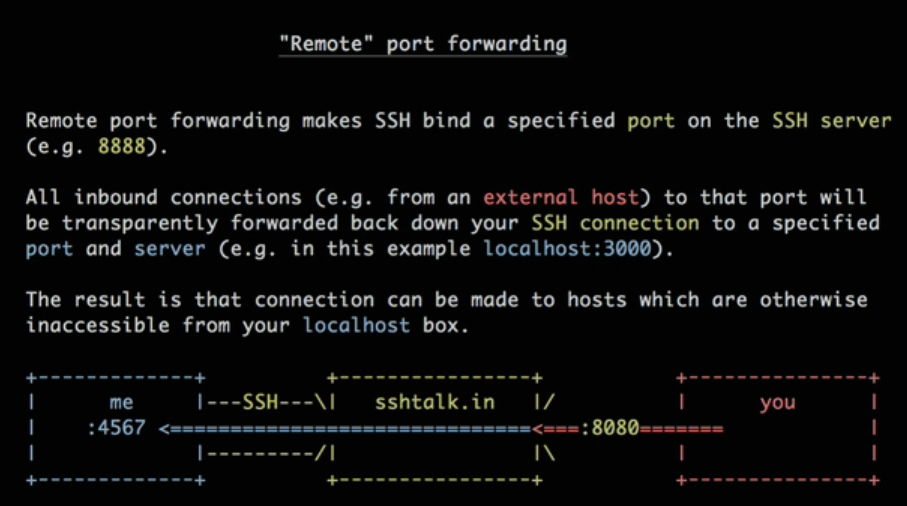
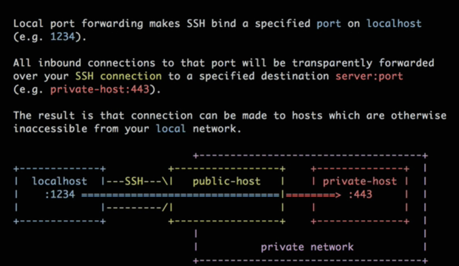
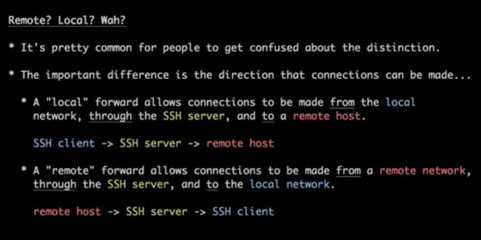
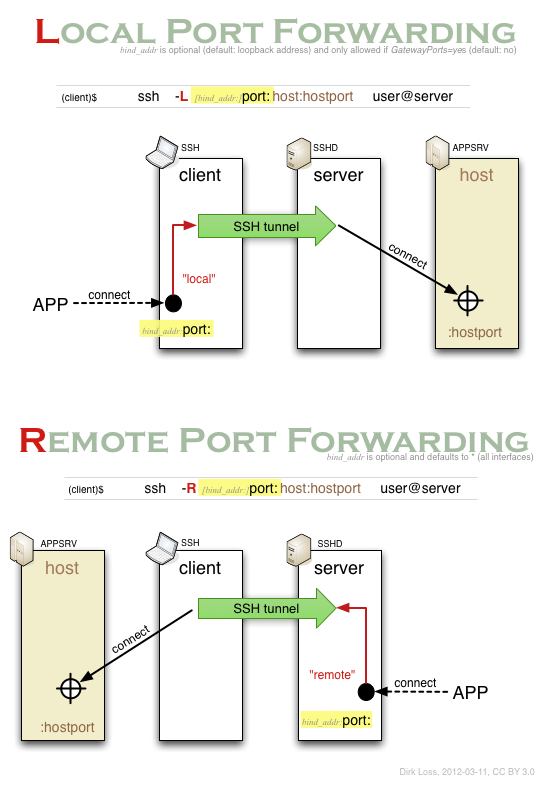

# Why SSH &mdash; Secure SHell
Read these two FIRST!

[blackmagicOfSSH](https://vimeo.com/54505525)

[portforward.com](https://portforward.com/)

remote management of UNIX-like systems and many network devices

Secure shell (SSH) is a protocol for creating an **encrypted communications channel** between two networked hosts.

### what is "openSSH"
opensource implementation of SSH. lol

There's a team of BSD geeks (openBSD) which actively maintains a branch of _clean_ , _light_ openSSH which just works for BSD. another team works hard to maintain another branch which is portable across so many linux distros..while patching from the main branch


**replacement of**: telnet, RSH, rlogin, FTP

**foundation of** :SCP, SFTP

### SSH Server (sshd)
Listens on the network for incoming SSH requests

How to check if sshd is running (from outside)?
While the surest way is just logging into the server, a better way would be just check if the PORT 22 responds to a TCP request

`netcat -v 12.11.1.2 22` will print the SSH banner!

How to check if sshd is running (from inside)?

`ps ax | grep sshd`

If its not running, enable it using `systemctl restart sshd`

### SSH client (ssh)
User uses ssh client to connect to a remote machine. (remote machine runs the SSH server)

### SSH encryption of the communication channel
_**Cryptographic key exchange is the heart of SSH protocol**_

You know that the SSH server holds the public key

You know that the SSH client holds the private key

You also know Asymmetric encryption is very slow compared to symmetric.

So, SSH will use Asymmetric encryption 
 1. to negotiate & securely exchange a temporary key pair.
 2. Use this temporary key pair to derive a symmetric key.
 3. Use that symmetric key for <u>further communication using symmetric encryption</u>

If the connection runs for a long time, the connection will intermittently repeat the above process


## Configuration /etc/ssh

ssh (the client) has its config in `/etc/ssh/ssh_config`

sshd (the server) has its config in `/etc/ssh/sshd_config`

### Configuring sshd (server)
-> lets you restrict who can connect to this server, what actions they can take

While editing sshd_config, you can use the following debugging approaches
- Alternate config files & ports
- debug mode

Lets start by using an alternate config...cuz..who wants to mess with the original config file . right?
`/usr/sbin/sshd -f sshd_config.test`. Okay. this will error out. Because your original sshd is already running on port 22. So edit sshd_config.test file to bind to another port OR just `/usr/sbin/sshd -f sshd_config.test -p 2222`. 

#### Verify a config files (-t)
`sshd -t`

#### Running sshd in debug mode (-d)
Will be able to see in detail whats happening (during daemon startup, during client connection). BUT, only ONE client will be able to connect. Just one session. after that sshd will die. So use it just for debugging once. (Run this on alternate port -p 2222)

## SSH Tunnels &mdash; Local Port Forwarding
Access private resources on the cloud without exposing the port publicly

# Forwarding
## "Remote" port forwarding (-R) 
A.K.A **Inbound Tunneling**

```
FORWARD a REMOTE port ( of a host that i have access to ) such that when anyone sends packets to that REMOTE port, it should get forwarded elsewhere , usually my local PC port where i ran the ssh command to do this
```


Expose local services to remote clients over your **outgoing connection** without having to mess with inbound firewalls

- Share your WIP web app without "deploying"
- Remotely pair program with people over SSH + Tmux
- SCP a file from your laptop to a server (no need to PUSH the file, just PULL it)


`ssh -R 8080:localhost:4567 dhiraj@sshtalk.in`

sshtalk.in is a public server that I should be having access to

## "Local" port forwarding
A.K.A **Outbound tunneling**

```
Forward my LOCAL port...as in, whenever is send packets to this LOCAL port, it should get FORWARDED elsewhere
```

User remote services through local ports ( that might otherwise be externally inaccessible)

- Connect to a staging envt SQL DB
- Directly debug a misbehaving web process, bypassing reverse proxies and load balancers
- Bypass firewall for any service ( as long as you have SSH )
- Bypass IP blocks one port at a time


`ssh -L 1234:10.1.1.2:443 ubuntu@41.22.36.5` notice that the IP is private IP visible only to 41.22.36.5




## "Dynamic" port forwarding
Create SOCKS5 proxy - VPN like

If you have to access a bunch of networks , you would create N number of port forwardings

SOCKS proxy helps tunnel every connection from there

- lets you configure your entire machine ( or just a browser ) to route **all** traffic over your SSH connection

`ssh -D 5555 41.22.36.5` will create a SOCKS proxy on localhost:5555 that will route through bastion

Try it with `curl --socks5-hostname localhost:5555 https://any-host`

#### SOCKS &mdash; SOCKet Secure

works one layer above Transport layer (session layer)

#### How is SOCKS different from port forwarding? #### How is a NAT different from a Proxy?
## X11 forwarding
## Agent forwarding
## "Remote" port forwarding

# About telnet &mdash; granddaddy of ssh


# Questions
- Why does ssh_d need to have a private key? `HostKey`? why?
- what is SOCKS. 4,5?
- ssh and firewall? how can one get through firewall with ssh??
- what is a reverse DNS?
- what is syslogd?
- waht is RED (random early drop)? Say a remote server is being DOS'ed. How can the sysadmin get in in such situations?
- chroot?
