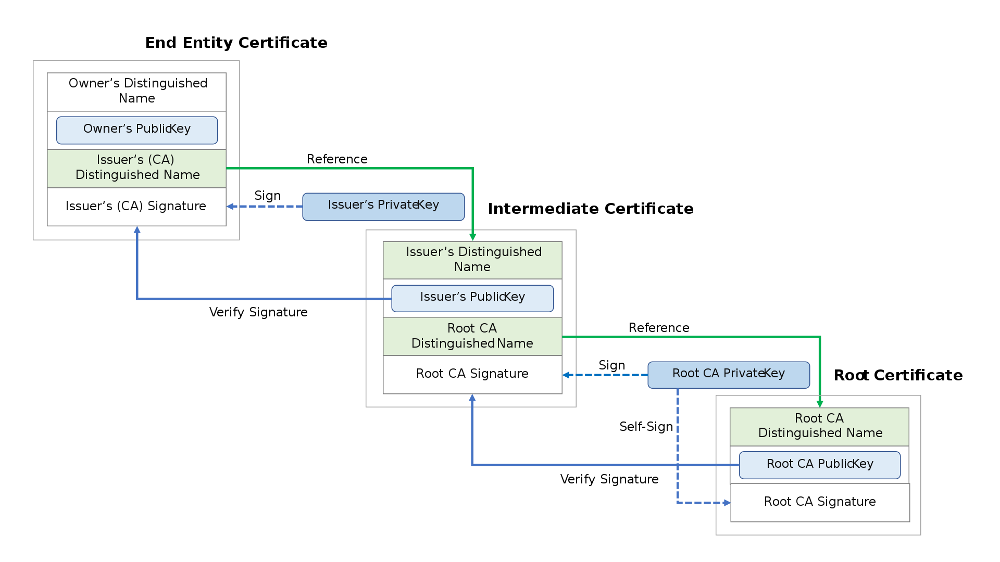

TODO:
1. trim this doc
2. do that "important activity" noted down, for understanding cert chains
# SSL/TLS 
*Encryption and Authentication*

SSL works on top of TCP
### Encryption
- to access a protected resource via [ Public Key Encryption + Symmetric Key Encryption ]
    - asymmetric encryption is used at the time of the SSL Handshake as a verification method, where the browser and the server negotiate an encrypted connection and exchange Session Keys.The session keys use symmetric encryption to further communicate during the entire secure session.

### Authentication 
- to authenticate owner of the SSL cert
    - _"Can I trust the server...is he who he claims to be?"_
- to authenticate the client(optional)
    - _"Can I trust the client...is he who he claims to be?"_
- **YES!, its not just the server that can be  authenticated. Client also has a certificate!!!, but client auth is not compulsory**

## SSL handshake protocol
- To "establish" the HTTPS connection
    - ##### Exchange (and negotiation) of encryption capabilities
    - ##### Authentication of Server's SSL cert
        Server sends the SSL Certificate chain (it includes leaf and intermediate certificate) to the Client. Then, the Client will start checking whether the certificate is legitimate by verifying the digital signature of the certificate and the certificate chain and checking if there’s any potential problem with the certificate data (whether the certificate is expired, wrong domain name, etc.). 

    - ##### Generate and exchange session key.
        The client will also make sure that the server possesses the private key of the certificate and this entire process is done during the key exchange/generation. 
    

Both parties will now have a session key and will begin to communicate with an encrypted and authenticated connection. At this point, the first bytes of “application” data (the data belonging to the actual service about which the two parties will communicate – i.e., the website’s HTML, Javascript, etc.) can be sent.

#### How does a Client authenticate a Server?

#### How does a Server authenticate a Client?

_Note: this is not common_

Typically, SSL/TLS certificates are installed on servers, and that’s why some call them “SSL server certificates.” But not many are aware of SSL/TLS with client authentication.

SSL/TLS client authentication, as the name implies, is intended for the client rather than a server. In server certificates, the client (browser) verifies the identity of the server. If it finds the server and its certificate are legitimate entities, it goes ahead and establishes a connection. The entire process happens during SSL/TLS handshake.

Now, let’s turn the tables.

What if a server does a client’s verification? Sounds unheard of? Well, it’s a thing. SSL/TLS client authentication works pretty much the same way as SSL server authentication—but in the opposite direction.

In client authentication, a server (website) makes a client generate a keypair for authentication purpose. The private key, the heart of an SSL certificate, is kept with the client instead of the server. It’s stored in the browser. The server confirms the authenticity of the private key and then paves the way for secure communication.

##  Cipher Suites & Negotiation

#### 1. Key Exchange Algorithm
the "Key" here is the symmetric key which will be eventually used to encrypt the channel. But how do we share or "Exchange" this key 

Asymmetric algos like RSA, ECDHE, ECDH, DHE help exchange symmetric keys over the network.

#### 2. Authentication Algorithm
Asymmetric algos like RSA, ECDHE, ECDH, DHE help authenticate parties involved.

Will sorta involve one party sending some data and expecting some exact data from other party. If other party is able to read the data and respond as per expectations, it means its public key is valid==> authenticated

#### 3. Bulk Encryption Algorithm
 This is the symmetric key algo that will be used for encrypting the channel

 CAMELLA, AES, 3DES

#### 4. MAC (Machine Authentication code) Algorithm
pass

### Negotiation
At the time of Handshake, the server and the client exchange a list of prioritized cipher suites and decide to use the one which is best supported by both.

# Public Key Infrastructure
_its not just publickey+privatekey_

PKI (Public Key Infrastructure) is a set of rules, procedures and policies that are needed to create, distribute, manage, store, use or revoke certificates and manage public-key encryption.

## Key components of PKI
- Certificate Policy
- Root CA
    - Main root of trust
    - accountable for identitiy authentication
- Intermediate CA
    - certified by a root CA
    - used to sign and issue digital certs
- Certificate DB
- Revocation Services
- Digital Certificates
    - Digital identity issued by intermediate CA

The Root CA provides the rights to subordinateCA(intermediate CA) to sign digital certs for devices.

This heirarchy allows the rootCA to go offline ( good for security )

### Trust Hierarchy
How to trust a server? => through the SSL cert it gives 
How to trust the SSL cert? => through the CA that issued that cert 
How to trust the CA????

#### What is a CA?
They issue SSL certs 
They are a "trusted" 3rd party

#### What are root programs?
Root program runs some policies and validates requirements before adding a CA to the trusted root store.

Some globally known root programs 
- Apple Root Program
- Oracle Java Root Program
- Mozilla Root Program
- Microsoft Root Program

Also btw, the browser/OS comes with a set of already trusted CAs

#### Root Certificate
A public key cert which helps identify a root CA

They are self signed ( forming the basis of X.509 based PKI)

They are used to issue other certs (intermediate CA certs)

They are kinda banned from directly issuing Leaf SSL certs for the server.

#### Intermediate Certificate
Provides security to the Root Certificate

Also works as a trusted root to issue certs

#### Leaf Certificate ( the final SSL cert)
A leaf certificate, also known as the end-entity certificate, is the last non-CA certificate of the chain which consists of a public key which is used by the users. These are the end-users’ SSL Certificates which is not directly issued by the Certificate Authorities from their roots, as those roots are much valuable and a lot of risks are involved around it.

#### Chain of trust
Security provided by SSL certificates is based on a Chain of Trust that originates from the Root Certificate of Certificate Authorities like Sectigo, DigiCert, GeoTrust, etc to the user’s certificate. And further, these SSL certificates are accepted by popular web browsers that contain the validated digital signature of the CA. Though the CA’s identity is built by adding the root certificates in the web browsers and without that, no browser would know whether to accept an SSL Certificate issued by a CA.

Furthermore, the Certificate Authorities are very strict with their guidelines and to guard their Root Certificates from getting compromised, they use an Intermediate Certificate which helps in issuing the user’s end-entity or leaf certificate.

> The above image is wrong in the fact that **private keys are used to digitally sign something**,  not public key

Moreover, Digital Certificates are verified via a chain of trust which is a list of certificates in an order. This contains End-Entity Certificate (Leaf Certificate), Intermediate Certificate and Root Certificate, where the root certificate authority (CA) is the trust anchor for the digital certificates.

### Self signed SSL certificates
- not signed by CA
- free
- people who visit that website will see a warning in their browser

### Do this activity !important!!!!!
https://medium.com/@superseb/get-your-certificate-chain-right-4b117a9c0fce

## The SSL Certificate
- contains server's public key

# IP whitelisting
before understanding IP whitelisting, checkout what a firewall means
## Firewall
Firewalls work by defining rules that govern which traffic is allowed, and which is blocked. 

`iptables` in linux is used to define the firewall.  `iptables` identifies the packets received and then uses a set of rules to decide what to do with them.

**When a packet is received, iptables finds the appropriate table, then runs it through the chain of rules until it finds a match.**

- **Table**: A table consists of several **chains**.
- **Chain**: A chain is a string of **rules**. 
- **Rule**: A rule is a statement that tells what to do with the packet, i.e decision, a.k.a &mdash; **target**.
- **Target**: A target is a decision of what to do with a packet. Accept it , drop it, or reject it (which sends an error back to the sender).

#### todo....explain more on firewall

## How to check firewall on remote machine
you can use netcat, nmap, telnet or even curl. 

- if you get timeout, port is not open
- if you get "Connection refused", port is open but process is not listening
- if you get timeout, port is not open
- if you get timeout, port is not open

# Life without SSL
### APT - Advanced Persisten Threats

### MITM - Man in the middle Attack

### Protocol attacks
DOS, DDOS etc
# Question
1. root ca, intermediate ca , your ca
